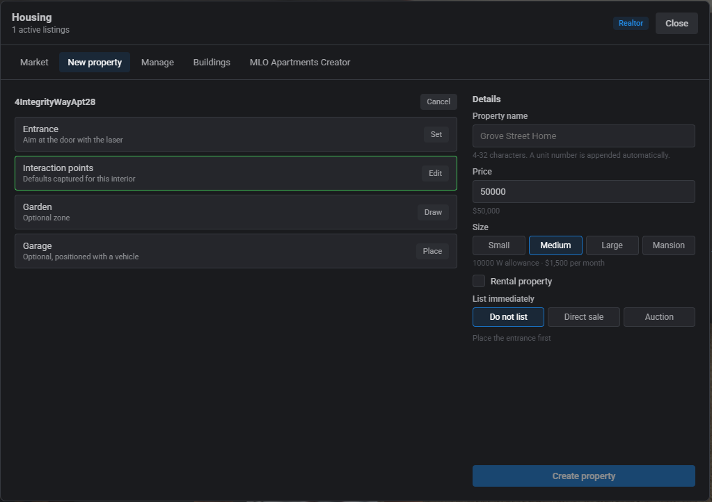

# qbx_properties

Player housing for Qbox. Apartments, shell interiors and MLO houses with an in-game realtor job, a furniture editor, a property market, rent and utilities, and police raids.

## Showcase

**Creating a property** — a realtor sets up an MLO house from the New property tab: capture the interior point, pick the doors with the laser, draw the garden zone, set price and size, list it, and another player buys it straight off the market.

[▶ Watch: creating a property](.github/media/creating-a-property.mp4)

**The furniture editor** — catalog, gizmo placement, modular walls with the 32-colour tint palette, snapping, the fine-tune panel and mounting the housing tablet on a wall.

[▶ Watch: the furniture editor](.github/media/furniture-editor.mp4)

**The housing tablet** — mounted in the property, opened through ox_target. Room management grants door/stash/furniture/garage access per citizen.

[▶ Watch: the housing tablet](.github/media/housing-tablet.mp4)

**Utilities** — the tablet's Utilities tab: live power draw against the property's allowance, humidity, and paying the monthly bill. Furniture and lighting persist across relogs.

[▶ Watch: utilities](.github/media/utilities.mp4)

**Breaching and wall colours** — police breach an apartment door with the battering ram, and the tablet's Wall colour tab repaints a unit's walls from the same 32-colour palette.

[▶ Watch: breaching and wall colours](.github/media/breaching-wall-colour.mp4)

**Police raid** — starting a raid with a warrant at the receptionist, then going through the unit and robbing the safe.

[▶ Watch: a police raid](.github/media/police-raid.mp4)

## Screenshots

### Market


Every active listing with photos and prices, filterable by direct sales or auctions. Realtors see the same page plus their tools.


A listing opened: photo gallery, the realtor's pitch, price, and the buy button. Auctions show current bid, time left and bid history instead.

### New property


Realtors pick a predefined interior — IPL apartments already exist in the world and only need an entrance, shells get spawned and positioned — or start an MLO property.



The IPL flow: aim at the door with the laser to set the entrance; interaction points come pre-captured for known interiors and can be edited.


The MLO flow: stand inside and capture the interior point, add the door(s), and optionally a garden zone and a garage spot. Price, size and rental terms on the right, with the option to list immediately.


All of it happens standing at the property, not in a config file.

### Manage


Every property on the server with owner and status, searchable and filterable.


A selected property: edit price/size/description, take listing photos, re-place the garage, redraw the garden, and for MLOs re-set the interior point or add more doors. Realtors can also enter the property remotely to fix its interior points.

### Buildings


Multi-unit buildings: pick a floor, see every unit and its tenant, and create the remaining units in bulk with a price and rental terms.

### MLO Apartments Creator


Turns any multi-room MLO into an apartment building. It scans the interior you are standing in and detects the room naming pattern.


Walk the building capturing the entrance, receptionist, elevators, floor heights and one anchor per room — it validates as you go and writes `config/buildings.lua` when everything lines up.

## Features

**Properties**
- Pooled IPL apartments (Del Perro, Integrity Way, Richard Majestic, Tinsel Towers) plus multi-unit apartment buildings with per-floor rooms, doorbells and shared parking garages — the Wiwang Hotel, the four Prodigy towers ([docs/prp-apartments.md](docs/prp-apartments.md)) and the Starlite Motel ([docs/starlite-motel.md](docs/starlite-motel.md)) ship preconfigured
- Garages register with qbx_garages by default or bridge to jg-advancedgarages, cd_garage or okokGarage through one config option — see [docs/garage-systems.md](docs/garage-systems.md)
- Phone home apps hook in through secured exports (list homes, waypoint, lock doors, manage keys) — drop-in lb-phone files and an sd-phone adapter ship in [docs/phone-integrations.md](docs/phone-integrations.md)
- Tenants can relocate between buildings, gated by config: free moves at the reception, plus a one-time migration offer on login whenever new buildings open with free rooms
- Admins can furnish a unit and run `/saveroom` to save it as the default loadout for that room layout — every fresh tenant starts with those pieces already placed and fully editable
- Standalone properties using interior shells, IPL interiors or real MLO houses
- MLO properties live in the actual world: walk in through the (locked) front door, furniture and stashes load in place, and extra doors can be added at any time
- Owned properties show house and garage blips, and can be spawned into from the spawn selector

**Realtor job**
- Create properties entirely in game: pick the door with a laser pointer, capture the interior point, set price, size and rental terms
- Manage menu: edit price/size/description, take property photos (uploaded to the Qbox CDN), place garages, draw garden zones, add doors, re-capture the interior point and enter properties remotely
- Realtors earn a configurable commission on sales and rent of properties they created

**Decorating**
- Furniture catalog with preview images, freecam and a gizmo for placement
- Snapping: to the ground, to the nearest wall, and modular pieces (walls, floors, stairs, arches) snap to each other; doors seat into arches
- 32 tint colours on the bundled structural props, matching the wall colour palette
- Fine-tune panel for exact coordinates and small nudges, including screen-relative movement
- Furniture can carry a `price` — priced pieces land in a shopping cart and get paid for in one go, and an unpaid cart is set aside when you leave the editor and offered back next time
- Inventory items can become furniture: scripts register their item and the player places it inside their property, metadata intact, with a pickup button in the editor to take it back. The crafting bench uses this — see [docs/placeable-items.md](docs/placeable-items.md)
- Garden zones are decoratable too — walk into your garden and the same editor opens from the radial menu
- Other players inside the property (or garden) see furniture being moved live while you edit
- Stash furniture registers real ox_inventory stashes with persistent slots, so removing and replacing a stash reconnects its contents
- Wardrobe and logout furniture (logout can be disabled in config)

**Economy**
- Market with direct sales and auctions (configurable durations, anti-snipe)
- The market UI can be embedded in laptop and tablet resources (fd_laptops and similar), with `/housing` optionally disabled — see [docs/third-party-ui.md](docs/third-party-ui.md)
- Rent cycles and utility billing with power usage and humidity per property size
- Optional society/government accounts for proceeds and bills

**Crime**
- Burglary through lockpicking with a skill check, alarm sound (native audio, replaceable) and dispatch hooks
- Police raids: search warrant at a receptionist, battering ram door breach, access to the property while the raid is active

## Dependencies

- [qbx_core](https://github.com/Qbox-project/qbx_core)
- [ox_lib](https://github.com/CommunityOx/ox_lib)
- [oxmysql](https://github.com/CommunityOx/oxmysql)
- [ox_inventory](https://github.com/CommunityOx/ox_inventory)
- [ox_target](https://github.com/CommunityOx/ox_target)
- [ox_doorlock](https://github.com/CommunityOx/ox_doorlock) for property and apartment doors — needs a few small additions, see below
- screencapture (the screenshot-basic replacement) for realtor property photos

**Optional integrations** (detected at runtime, everything works without them)

- [Renewed-Banking](https://github.com/Renewed-Scripts/Renewed-Banking) — receives the `marketSociety` and `governmentAccount` payouts; without it those payouts are skipped
- [scully_emotemenu](https://github.com/Scullyy/scully_emotemenu) — its keybinds are suspended while decorating so emote keys can't fire mid-edit

**Assets used by specific features**

- [Battering-Ram](https://github.com/Epixx1337/Battering-Ram) — the two-handed ram weapon (`WEAPON_BATTERINGRAM`) used for police door breaches, with its looping breach animation
- [wiwang_hotel](https://github.com/Epixx1337/wiwang_hotel) — our edit of the Wiwang Hotel MLO with per-room `wall_tint` entity sets, required for wall colours inside its apartments
- [prp-housing shells](https://studio.prodigyrp.net/map) — the ProdigyRP house MLOs, required for wall colours in those interiors
- The free starter shells are from [K4MB1](https://forum.cfx.re/t/free-props-starter-shells-for-housing-scripts/4826922)

## Installation

1. Remove `qbx_apartments` and `qbx_houses`
2. Either use no spawn system (the core defaults to last location) or [qbx_spawn](https://github.com/Qbox-project/qbx_spawn)
3. Start the resource once — it creates and migrates its database tables automatically. The `.sql` files in the resource root can also be run by hand if you prefer.
4. Set your Qbox CDN API key (see below) if you want realtor photos
5. Ensure the resource starts after its dependencies

The NUI is prebuilt in `web/build`. To rebuild after changing it: `cd web && bun i && bun run build`.

## Using a different multicharacter or spawn system

Nothing here depends on a specific multicharacter UI. Apartment assignment hooks `QBCore:Server:OnPlayerLoaded`, which qbx_core fires every time a character loads — so any multicharacter that logs characters in through qbx_core triggers it unchanged.

**First-login apartments** need `characters.startingApartment = true` in qbx_core's `config/client.lua`. When a character loads with no property and no assigned unit, the apartment picker opens automatically; choosing a building grabs a free unit through the dynamic assignment (or creates an owned IPL apartment). There is no export to assign a unit because none is needed — it all happens on login. If you ever want to reopen the picker manually (say from your own intro flow), trigger the client event `apartments:client:setupSpawnUI` for that player.

**Spawn selectors** are equally swappable. Without qbx_spawn, qbx_core spawns characters at their last location and everything still works — players who logged out inside an MLO wake up where they stood, and players who logged out inside a shell or IPL interior are re-entered through their property automatically. A custom spawn selector only needs two integration points:

- To spawn a player into a property they own, trigger the server event `qbx_properties:server:enterProperty` with `{ id = propertyId }` shortly after `QBCore:Server:OnPlayerLoaded` — within the first minute after loading it is treated as a spawn, so the distance check is skipped and the screen fades in once they are inside.
- For a "last location inside their home" option, read the character's `metadata.currentPropertyId`; when it is set, pass that id through the same event instead of teleporting to raw coordinates. MLO properties don't need this — their saved position is a real-world coordinate.

The list of properties a character owns is a plain query on the `properties` table by `owner` citizenid, which is how qbx_spawn builds its spawn list.

## ox_doorlock additions

Stock ox_doorlock only manages doors through its admin UI and has no access hooks, so it needs three small additions. Without them the resource prints a warning on start and property doors are skipped.

**1. The hook system.** Copy [docs/ox_doorlock/hooks.lua](docs/ox_doorlock/hooks.lua) into ox_doorlock's `server/` folder, then wire it into `server/main.lua`. At the top of the file:

```lua
local TriggerEventHooks = require 'server.hooks'
```

And at the end of the authorisation function (right after the `::continue::` label, replacing the plain `return authorised`):

```lua
    local hookResult = TriggerEventHooks('doorAuthorization', {
        source = playerId,
        door = door,
        lockpick = lockpick,
        authorised = authorised,
    })

    if hookResult == nil then return authorised end

    return authorised or hookResult
```

qbx_properties registers a `doorAuthorization` hook on its own doors to let owners, keyholders and realtors through, and to unlock everything while a door is breached — normal ox_doorlock doors are untouched thanks to the hook's name filter.

**2. Two exports** in `server/main.lua`, slotted in after the existing ones — `createDoorProgrammatic` to register doors at runtime and `removeDoorByName` to clean them up:

```lua
exports('removeDoorByName', function(name)
    local results = MySQL.query.await('SELECT id FROM ox_doorlock WHERE name LIKE ?', { name .. '%' })
    if not results then return end

    for _, row in ipairs(results) do
        MySQL.update('DELETE FROM ox_doorlock WHERE id = ?', { row.id })
        doors[row.id] = nil
        TriggerClientEvent('ox_doorlock:editDoorlock', -1, row.id, nil)
    end
end)

exports('createDoorProgrammatic', function(data)
    if not data or not data.name or not data.coords then return end

    if type(data.coords) ~= 'vector3' then
        data.coords = vector3(data.coords.x, data.coords.y, data.coords.z)
    end

    if not data.state then data.state = 1 end

    local insertId = MySQL.insert.await('INSERT INTO ox_doorlock (name, data) VALUES (?, ?)',
        { data.name, encodeData(data) })
    if not insertId then return end

    local door = createDoor(insertId, data, data.name)
    TriggerClientEvent('ox_doorlock:setState', -1, door.id, door.state, false, door)

    return insertId
end)
```

`createDoorProgrammatic` inserts the door into the `ox_doorlock` table, registers it live and syncs it to every client, defaulting to locked. `removeDoorByName` deletes every door whose name starts with the given prefix, which is how a property's furniture and extra doors are cleaned up before re-syncing. qbx_properties uses them for apartment unit doors, MLO property doors and placeable door furniture, and only creates a door when no door with that name exists yet.

## Property photos (CDN)

Realtor photos are uploaded to an image CDN. Three providers are supported out of the box — pick one, create an API key on their dashboard, and set it in `config/server.lua`:

```lua
imageUpload = {
    provider = 'qbox', -- 'qbox', 'fivemanage', 'fivemerr' or 'custom'
    apiKey = 'YOUR_API_KEY',
    maxImages = 5,
},
```

| Provider | Get a key | Deletes on photo removal |
| --- | --- | --- |
| `qbox` | [Qbox CDN dashboard](https://docs.qbox.re/dashboard/cdn) | yes |
| `fivemanage` | [Fivemanage dashboard](https://docs.fivemanage.com) | yes |
| `fivemerr` | [Fivemerr dashboard](https://docs.fivemerr.com) | no delete API |

With the key left empty, the Take photo button reports that uploads are not configured and everything else keeps working. Any other host that accepts multipart uploads and returns a URL in its JSON response works too — set `provider = 'custom'` and fill in the `custom` block (`url`, `field`, `responsePath`, and optionally `storagePath`/`deleteUrl` if the host supports deletion).

## Configuration

| File | Contents |
| --- | --- |
| `config/shared.lua` | realtor jobs, property sizes, market rules, utilities, wall colours, apartment garages |
| `config/client.lua` | furniture catalog, interior IPL data, editor settings |
| `config/server.lua` | payouts, rent, stash sizes, image upload |
| `config/crime.lua` | robbery and raid rules, alarm sound |
| `config/dispatch.lua` | hooks to send alerts to whatever dispatch the server runs |
| `config/buildings.lua` | multi-unit apartment building layouts (written by the MLO Apartments Creator) |
| `config/garages.lua` | adapters for third-party garage systems |
| `config/shell_defaults.lua` | interaction points for the bundled shells |

Options worth knowing about:

- `realtorJobs` / `realtorRequiresDuty` (shared) — which jobs and grades get the realtor tabs, and whether they must be on duty.
- `logoutEnabled` (shared) — beds and logout points let players switch character; `false` hides them everywhere.
- `furnitureShop` (shared) — `false` ignores all furniture prices, so everything places instantly for free and the cart never appears.
- `furnitureImageSource` (shared) — `'cdn'` lazy-loads the furniture catalog thumbnails from uploaded CDN copies instead of resource files, see "Regenerating catalog images".
- `apartmentChoice` (shared) — `false` skips the apartment picker at character creation and assigns the first available apartment automatically. A single active building already skips the picker on its own.
- `freeApartmentMoves` (shared) — `false` locks tenants to their apartment building; the reception refuses switching.
- `migrationOffer` (shared) — `false` disables the one-time relocation offer shown on login when other buildings have free rooms.
- `housingCommand` (shared) — `false` removes the `/housing` command; the UI stays reachable through the `openHousing` export or an embedded app, see [docs/third-party-ui.md](docs/third-party-ui.md).
- `garageSystem` (shared) — `'qbx'` uses qbx_garages; other values bridge property and apartment garages to third-party garage scripts, see [docs/garage-systems.md](docs/garage-systems.md).
- `stairsOnly` (buildings) — marks an apartment building without elevators, like the Starlite Motel: elevator fields are skipped and move-in messages point at the stairs.
- `targetInteractions` (shared) — MLO furniture uses ox_target labels instead of floating interaction points.
- `propertySizes` (shared) — each size sets the power allowance (W) and the monthly utility cost; realtors pick the size on creation.
- `utilities` (shared) — billing period, grace period, and the humidity model (base level, effect per kilowatt, comfort threshold).
- `commission` (shared) — the cut of sales and rent paid to the realtor who created the property.
- `market` (shared) — price bounds, auction durations, anti-snipe window, whether bids are anonymous, and how close an agent must be to bid on a client's behalf.
- `gardens` (shared) — furniture limit, zone corner cap and maximum build height for garden zones.
- `wallColors` (shared) — the 32-colour palette and the `entitySet` name the tinted wall meshes use. Interiors need tint-capable walls (see the asset list above); the same palette drives furniture tints.
- `apartmentGarages` (shared) — one garage per complex, every bay doubles as menu and park point. The `name` is stored on parked vehicles, never change it or those vehicles become unreachable.
- `robbery` (crime) — restrict burglary to MLO properties or include apartments (`allowApartments`), the lockpick item, skill check pattern, cooldown, and the alarm (a native audio file you can replace).
- `raids` (crime) — which jobs can raid, the warrant item checked at the receptionist, and the breach weapon (`WEAPON_BATTERINGRAM` from the asset list, optionally required in hand).
- `marketSociety` / `governmentAccount` (server) — society accounts receiving ownerless sale proceeds, utility bills and the non-commission share of rent; `nil` disables them.

## Setting up shells

`/shellsetup` walks a realtor through every shell that still needs its points (exit, stash, wardrobe, logout) using the laser pointer, and `/shellsetup all` re-runs every shell and IPL. Points are saved to the database and override `config/shell_defaults.lua`.

## Editor controls

While decorating: `E` toggles between the catalog and the world, **hold `F` to fly the freecam**, `Alt` selects a placed object. With an object held: `T`/`R` switch the gizmo between move and rotate, `L` switches world/local axes, `G` snaps to the ground, `H` snaps to the nearest wall, `N` snaps modular pieces together, `Enter` confirms. `Backspace` exits.

## Regenerating catalog images

The furniture catalog images in `screenshots/` are shot in game by the admin-only `/screenshotfurniture` command (requires the screencapture resource to be running — nothing to uncomment, nothing to install):

- `/screenshotfurniture` photographs every catalog entry that has no image yet, so interrupted runs resume where they stopped; `/screenshotfurniture overwrite` reshoots everything, `/screenshotfurniture manual` starts paused with full control per shot.
- Each item is captured twice against two backdrop colors and a difference matte solves the exact per-pixel alpha — transparent parts, glass and green furniture come out clean. The image is cropped, encoded to webp in the NUI and saved to `screenshots/`, no external image tooling involved.
- The studio panel (top right) can pause a batch at any time: navigate items with ◀ ▶, drag ←→ to rotate the piece, drag ↑↓ to raise or lower the camera, scroll to zoom, nudge the FOV, and swap the backdrop color for pieces that blend into it. **Shoot** reshoots the current item with the current framing, **Save framing** persists it to `screenshots/_tuning.json` so every future batch uses it — it overrides the `screenshotRotation`/`screenshotFov`/`screenshotCameraOffset` catalog fields, which still work as before.

### Serving the images from a CDN

`screenshots/` normally streams to every client with the resource. To serve the thumbnails over HTTP instead:

1. Configure `imageUpload` in `config/server.lua` (the same provider used for property photos). `autoUpload = true` uploads every shot as it is saved, or run `/screenshotfurniture upload` to push everything missing (`uploadall` re-uploads all) — the file → URL mapping is kept in `screenshots/_cdn.json`.
2. Set `furnitureImageSource = 'cdn'` in `config/shared.lua`. The catalog lazy-loads thumbnails from the CDN — only what is on screen is fetched — and any image without an uploaded copy falls back to the local file, so a partial upload never breaks the UI.
3. Once everything is uploaded, the `screenshots/*.webp` entry can be removed from `files {}` in `fxmanifest.lua` so clients stop downloading the images entirely.
